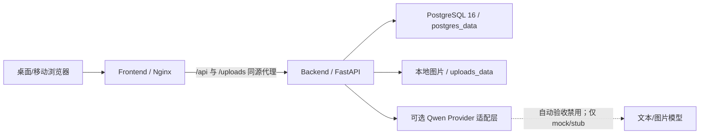
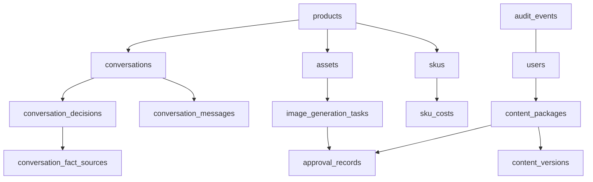
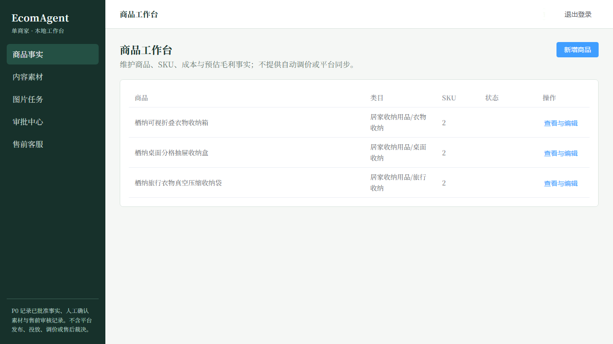
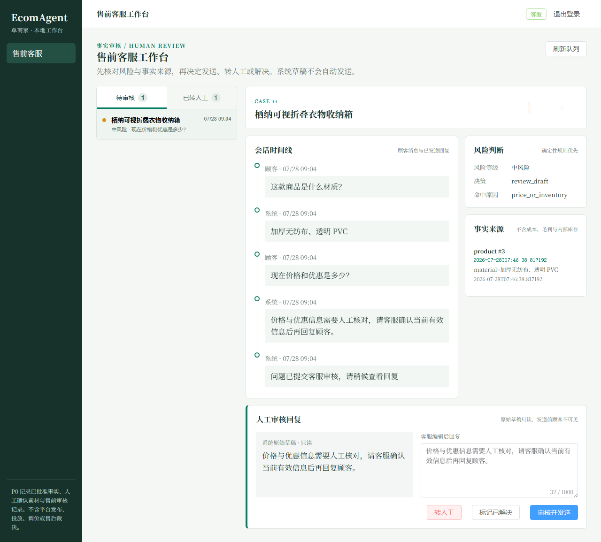
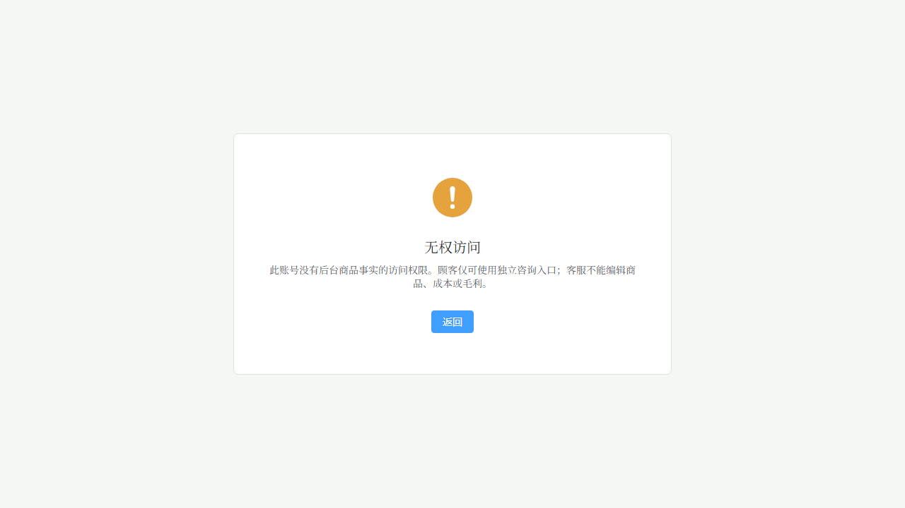
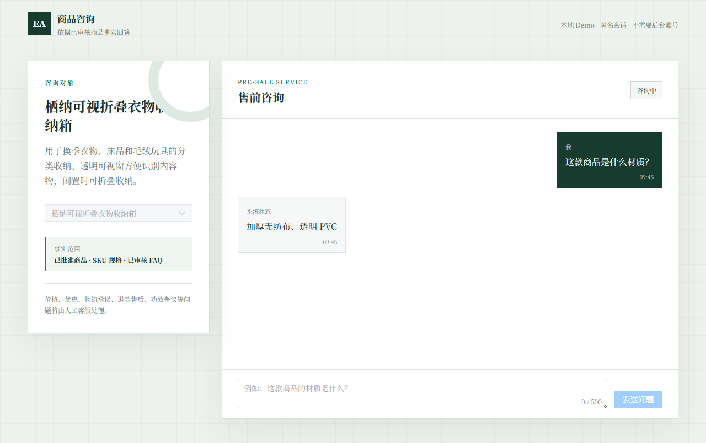
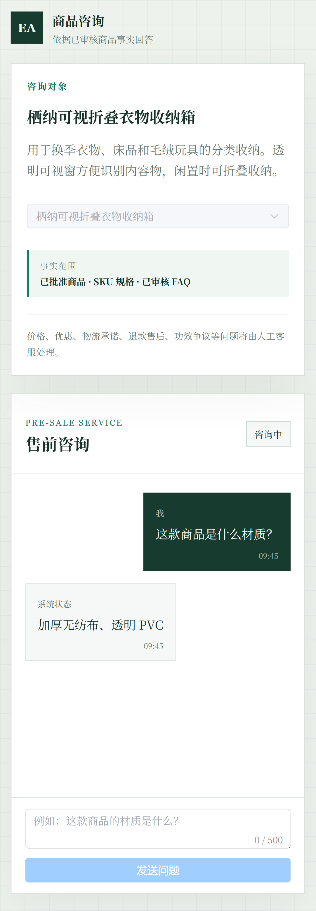

# EcomAgent P0 毕业设计证据索引

> 生成日期：2026-07-28
> 代码基线：`99b90920d37494defcf8ec5ec4ef256a6b212a6d` + Gate 4 最终集成交付工作区
> 数据边界：所有页面、指标和问答均来自固定 Demo/本地验收环境，不代表真实线上泛化效果、业务效果或平台排名。

## 1. P0 部署架构



三服务由单个 Docker Compose 编排。PostgreSQL 健康后后端先运行 `alembic upgrade head`，后端健康后前端才启动；最终前端生产构建固定 `VITE_USE_MOCK=false`。系统没有 Redis、平台 SDK、向量数据库或自由 SQL Agent。

## 2. 固定角色权限

| 能力 | 管理员 | 运营/内容 | 客服 | 匿名顾客 |
| --- | --- | --- | --- | --- |
| 商品、SKU、六项成本、预估毛利 | 查看/维护 | 查看/维护 | 仅已批准非财务事实 | 无后台访问 |
| 内容与图片素材 | 全部、审批、导出 | 创建、编辑、提交 | 禁止 | 禁止 |
| 售前会话 | 全部客服操作 | 禁止 | 审核、发送、转人工、解决 | 仅令牌隔离的本人会话 |
| 审计检索 | 允许 | 禁止 | 禁止 | 禁止 |

认证接口统一为 `POST /api/auth/login` 和 `GET /api/auth/me`；前端路由仅改善体验，最终权限由后端逐接口校验。

## 3. 当前数据模型



实际迁移还管理 `inventory`、`generated_contents`、`tool_call_logs`，以及明确标记为 P1/P2 兼容占位、P0 无 API 的 `orders`、`order_items`、`after_sales_rules`。预估毛利为确定性请求计算，不存在虚构的 `margin_snapshots` 或 `price_rules` 表。

## 4. 核心状态机

```mermaid
stateDiagram-v2
    state Content {
      draft --> submitted
      submitted --> approved
      submitted --> rejected
      rejected --> submitted
    }
    state ImageApproval {
      draft --> submitted: completed + 人工确认
      submitted --> approved
      submitted --> rejected
    }
    state Conversation {
      open --> waiting_review: 中风险 Qwen 内部草稿
      open --> transferred: 高风险/Provider 安全降级
      waiting_review --> open: 客服审核发送成功
      waiting_review --> transferred: 手工转人工
      transferred --> resolved: 客服/管理员解决
    }
```

低风险完整事实使用确定性模板；中风险仅生成内部草稿；高风险及 `no_key|timeout|failed|field_missing` 安全转人工。`waiting_review|transferred` 的顾客补充消息不重新自动化。

## 5. 本轮指标

| 指标 | 结果 |
| --- | --- |
| 后端默认 pytest | 189 passed，0 warning |
| 封闭 Demo 金标 | 50/50；仅表示固定数据集回归 |
| 封闭 Demo 红队 | 30/30；仅表示固定数据集拦截 |
| 前端 Vitest | 17 passed |
| Production build | 入口 8.21 KB；最大 JS chunk 351.10 KB |
| Playwright | 11 passed，1 个桌面项目中的移动专用断言按设计 skipped，0 failed |
| 商品查询性能 | Docker 同源链路，10 次预热 + 80 样本，P95 14.445 ms；阈值 1000 ms |
| Schema | 全新库与 Metadata 零差异；`app.main` 导入无副作用；head `20260726_04` |
| Docker P0 闭环 | PostgreSQL + 进程内离线 stub，完整流程 passed |

Docker P0 闭环使用随机隔离 PostgreSQL 数据库，结束后删除数据库和本次上传文件；参考图与导出图均在容器内由 Pillow 重新 `verify/load`。正式 Demo 只保留三款“栖纳家居”商品和幂等客服展示队列。

## 6. 关键页面截图

### 管理员商品工作台（桌面）



### 客服审核工作台（桌面）



### 运营越权拦截



### 独立顾客咨询页（桌面）



### 独立顾客咨询页（移动）

