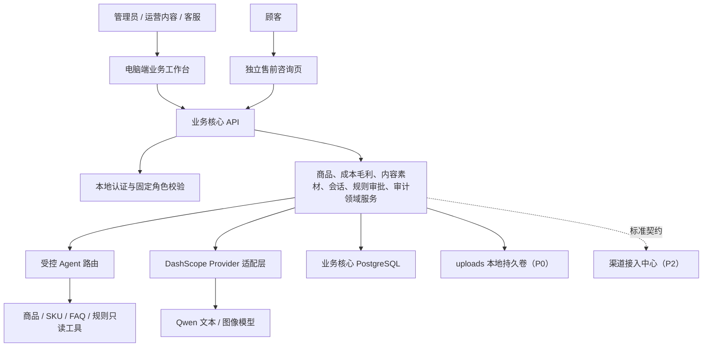
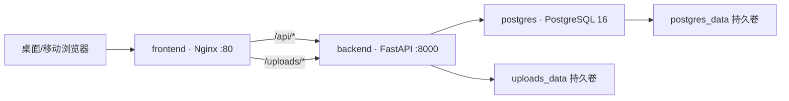
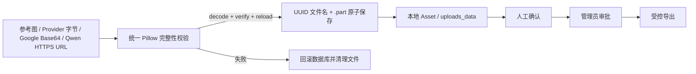
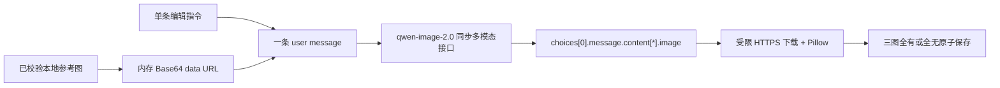

# 业务核心系统架构文档（P0）

状态：P0 最终集成架构，2026-07-28
关联文档：[P0 PRD](PRD_P0.md)、[渠道接入中心架构](../渠道接入中心/架构文档_P2.md)

## 1. 服务边界

## 2. 数据归属

| 数据 | 业务核心职责 |
| --- | --- |
| 商品、SKU、成本、价格、毛利规则、FAQ、内容、素材 | 维护标准业务语义、来源、版本和审批状态 |
| 会话、回复草稿、风险等级、人工处理 | 维护顾客服务状态与审计 |
| 订单、物流、售后 | P1/P2 后保存标准化事实；不持有平台原始载荷或 Token |
| 审批、导出、工具调用、错误 | 维护业务层可追溯记录 |

当前 SQLAlchemy Metadata 与 Alembic 迁移实际管理的 P0 运行表为：`users`、`products`、`skus`、`inventory`、`sku_costs`、`generated_contents`、`content_packages`、`content_versions`、`approval_records`、`audit_events`、`assets`、`image_generation_tasks`、`conversations`、`conversation_messages`、`conversation_decisions`、`conversation_fact_sources` 和 `tool_call_logs`。`sku_costs` 保存采购、包装、运费补贴、平台费、推广分摊、售后损失六项成本；预估毛利由确定性服务按请求计算并写入审计，不存在 `margin_snapshots`、`price_rules`、`media_assets`、`generation_tasks` 或 `agent_tasks` 表。

迁移链还包含早期建立的 `orders`、`order_items`、`after_sales_rules` 三个未来兼容占位表；它们明确属于 P1/P2 预留，P0 没有对应 API、页面、平台连接或自动执行能力。`inventory` 只供后台商品事实维护，顾客与客服响应不得暴露内部库存。

## 3. 受控 Agent

固定流程：意图识别 -> 参数校验 -> 白名单只读工具 -> 事实与风险检查 -> 生成结果 -> 自动回复/审核/转人工 -> 日志。内容和素材生成只能读取已授权事实；毛利计算必须由确定性规则完成，模型只能解释结果。模型没有直接读写数据库、发起退款、改价、投放或平台操作的权限。

## 4. 安全与隔离

- 后端逐操作校验角色，前端隐藏按钮不构成安全控制。
- 顾客页只获得受控回答或状态提示，不访问后台和原始商品配置。
- API Key、个人信息和未授权图片不得进入普通日志、导出或模型输入。
- 内容、图片、推广素材、成本口径和导出必须保留审批；删除素材仍保留审计记录。

## 5. 部署演进

| 阶段 | 部署 |
| --- | --- |
| P0 | 单 Docker Compose：业务核心前后端、PostgreSQL、本地文件；本地顾客页 |
| P1 | 单商家公网 HTTPS、对象存储、队列和备份；CSV/Excel 导入、选品/经营分析与调价建议 |
| P2 | 业务核心继续独立部署，通过内部 API/事件调用独立渠道接入中心；数据库账号与队列隔离 |

## 10. M4 最终部署拓扑与接口契约

- `docker-compose.yml` 只定义 `frontend`、`backend`、`postgres` 三个服务；P0 未使用 Redis、消息队列、向量数据库或平台 SDK。数据库健康后后端先执行 `alembic upgrade head`，后端健康后再启动前端。
- 浏览器正式接口统一为 `/api` 前缀；登录为 `POST /api/auth/login`，当前用户为 `GET /api/auth/me`。Nginx 仅做同源反向代理，不重写错误的业务路径。生产镜像构建固定 `VITE_USE_MOCK=false`。
- PostgreSQL 与上传文件分别使用持久卷。图片原文件和生成结果通过受控 `/uploads` 静态路径读取；Key 仅由部署环境注入，不进入镜像、仓库、日志、审计或模型安全事实摘要。
- 当前迁移 head 为 `20260726_04`。M4 不修改 01、02、03、04，也不新增 Schema，因此不存在 05 迁移；应用导入与启动只校验 Schema，不建表或补表。
## 11. M4.1 图片边界

- 允许格式为 PNG、JPEG、WEBP、BMP；同时限制文件字节、宽高和总像素数，扩展名必须匹配真实解码格式。HTTP `Content-Type` 不能证明图片有效。
- Qwen 临时 URL 只作为受控下载来源：必须为 HTTPS，受连接/读取超时、最大响应大小和最多 2 次重定向约束；下载后验证并本地化，不能成为长期素材地址。
- PostgreSQL 仅通过 Compose 内部网络供 backend 使用，宿主调试端口绑定 `127.0.0.1`。自动验收数据库与正式 Demo 数据隔离。
## 12. M4.2 Qwen 图片契约边界

参考图、Base64 和 Key 不跨越请求内存边界进入审计/日志。临时 URL 仅用于受限下载；最终 Asset 始终指向本地不透明文件。P0 不向 Provider 发送成本、毛利、内部库存或平台凭据。