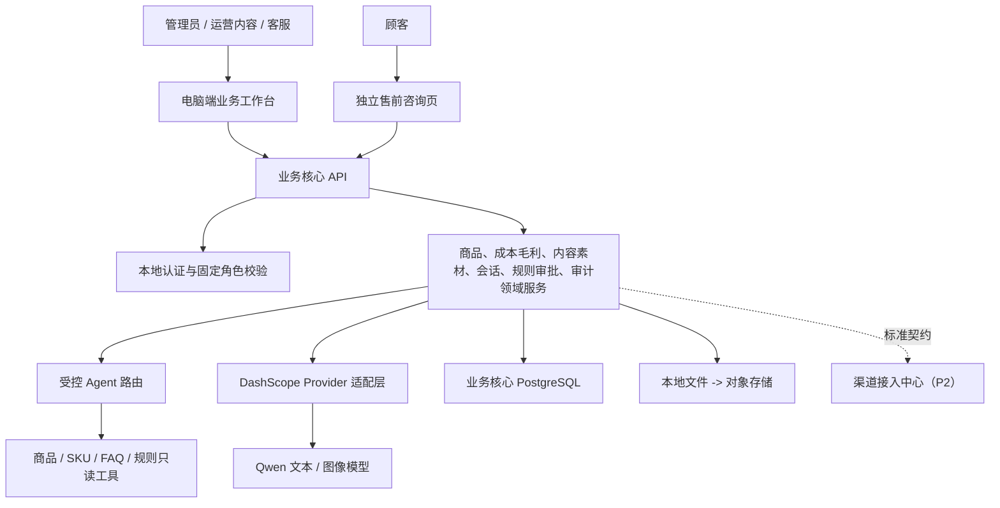

# 业务核心系统架构文档（P0）

状态：架构基线，2026-07-21  
关联文档：[P0 PRD](PRD_P0.md)、[渠道接入中心架构](../渠道接入中心/架构文档_P2.md)

## 1. 服务边界

## 2. 数据归属

| 数据 | 业务核心职责 |
| --- | --- |
| 商品、SKU、成本、价格、毛利规则、FAQ、内容、素材 | 维护标准业务语义、来源、版本和审批状态 |
| 会话、回复草稿、风险等级、人工处理 | 维护顾客服务状态与审计 |
| 订单、物流、售后 | P1/P2 后保存标准化事实；不持有平台原始载荷或 Token |
| 审批、导出、工具调用、错误 | 维护业务层可追溯记录 |

核心表至少包括 `users`、`products`、`skus`、`sku_costs`、`margin_snapshots`、`price_rules`、`content_packages`、`content_versions`、`media_assets`、`generation_tasks`、`conversations`、`agent_tasks`、`approval_records`、`audit_events`。

`sku_costs` 记录采购、包装、运费补贴、平台扣点、推广分摊和售后损耗及其来源、生效时间；`margin_snapshots` 记录计算输入快照、结果、公式版本和计算时间。P0 的 `price_rules` 只保存未来规则所需的最低毛利、价格上下限、频率和停用字段，不触发平台执行。

## 3. 受控 Agent

固定流程：意图识别 -> 参数校验 -> 白名单只读工具 -> 事实与风险检查 -> 生成结果 -> 自动回复/审核/转人工 -> 日志。内容和素材生成只能读取已授权事实；毛利计算必须由确定性规则完成，模型只能解释结果。模型没有直接读写数据库、发起退款、改价、投放或平台操作的权限。

## 4. 安全与隔离

- 后端逐操作校验角色，前端隐藏按钮不构成安全控制。
- 顾客页只获得受控回答或状态提示，不访问后台和原始商品配置。
- API Key、个人信息和未授权图片不得进入普通日志、导出或模型输入。
- 内容、图片、推广素材、成本口径和导出必须保留审批；删除素材仍保留审计记录。

## 5. 部署演进

| 阶段 | 部署 |
| --- | --- |
| P0 | 单 Docker Compose：业务核心前后端、PostgreSQL、本地文件；本地顾客页 |
| P1 | 单商家公网 HTTPS、对象存储、队列和备份；CSV/Excel 导入、选品/经营分析与调价建议 |
| P2 | 业务核心继续独立部署，通过内部 API/事件调用独立渠道接入中心；数据库账号与队列隔离 |
