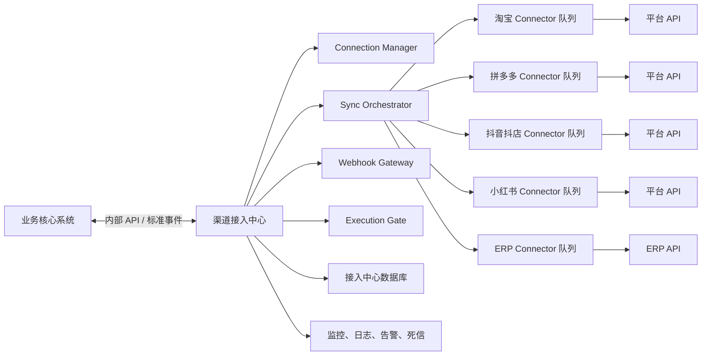

# 渠道接入中心架构文档（P2）

状态：P2 架构基线，2026-07-21  
关联文档：[业务核心架构](../业务核心系统/架构文档_P0.md)、[P2 PRD](PRD_P2.md)

## 1. 逻辑架构

## 2. 通信与数据边界

| 边界 | 允许 | 禁止 |
| --- | --- | --- |
| 业务核心 -> 接入中心 | 授权请求、同步请求、经审批的受控执行请求 | 直接使用平台 SDK 或读取渠道数据库 |
| 接入中心 -> 业务核心 | 标准化事实、同步状态、数据新鲜度、脱敏错误摘要 | Token、签名、完整原始载荷、限流状态 |
| Connector -> 平台 | 该 Connector 所需的最小 API 调用 | 共用其他 Connector 的 Token、队列或重试状态 |

标准对象为 `Product`、`Sku`、`ListingState`、`Order`、`Fulfillment`、`AfterSalesCase`、`PerformanceMetric`、`ConversationEvent`、`SyncResult` 和 `ExecutionResult`。每条对象包含渠道、外部 ID、标准版本、来源时间、同步时间、映射版本和幂等键。

`ListingState` 用于同步商品在渠道上的价格、库存和状态；`PerformanceMetric` 用于同步获批范围内的曝光、点击、转化、花费等经营事实。它们只提供给业务核心计算建议，P2 不据此执行调价或投放。

## 3. 数据与凭据隔离

- 接入中心拥有 `channel_connections`、`integration_jobs`、`connector_events`、`mapping_versions`、`dead_letters` 等数据。
- 每个连接单独保存授权范围、过期时间和加密凭据；仅接入中心的最小权限服务账号可读。
- 原始回调与原始 API 载荷仅按最小必要、脱敏和保留期要求保留；业务核心只保存标准化事实及来源摘要。
- 业务核心和接入中心不共享数据库账号；可在同一私有化实例中使用独立数据库或独立 Schema 与权限边界。

## 4. 可靠性与停用机制

| 场景 | 处理 |
| --- | --- |
| 限流/超时 | 单 Connector 退避重试和熔断，不阻塞其他任务 |
| Token 失效 | 停止该连接，告警管理员重新授权 |
| 映射失败 | 写入该 Connector 死信，返回待人工处理，不写入错误事实 |
| 回调重复/乱序 | 验签、幂等键和事件顺序控制 |
| 平台规则变更 | 立即关闭受影响能力，保留审计并重新验收 |
| 调价或推广执行异常（P3） | 立即关闭该 Connector 的该动作白名单，保留幂等键、审批和执行结果，转人工处理 |

## 5. 部署演进

P0 不启动该服务。P2 使用与业务核心同仓库、独立服务进程、独立数据库账号、独立 Worker 和独立队列部署；可按 Connector 单独扩缩容和停用。服务间通信仅限私有网络或受认证的内部端点。
